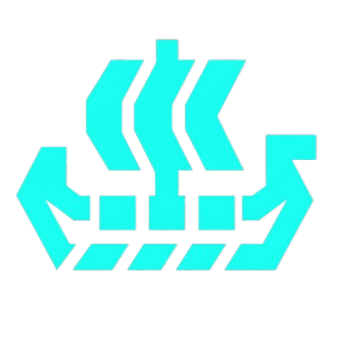

<div align="center">
  
  <h1>Ship of Theseus</h1>
  <p><i>Does a codebase remain the same if every line is replaced? A monthly pulse on software entropy.</i></p>
  <p>
    
    
    
    
    
  </p>
</div>

---

## 📖 The Philosophy: Why This Project Matters

The **Ship of Theseus** is a famous thought experiment: if you replace every wooden plank on a ship over time, is it still the same ship? 

This exact paradox plays out daily in modern software engineering. Repositories live for years, or even decades. The developers who started them leave, entire architectural paradigms shift, and eventually, the very last line of original code is overwritten. Yet, the repository retains its name, its URL, and its identity. 

**This project exists to visualize that journey.** It pulls back the curtain on repository decay and renewal by measuring *codebase entropy*; tracking when lines of code were written and how long they survive before being rewritten, effectively showing you the "age" of a massive software project at a glance.

### Why People Care About This
1. **Repository Health & Churn Visibility:** Open-source maintainers and engineering managers can visually assess how quickly a codebase is turning over. Is the core architecture stable (lots of old code), or is it undergoing a frantic rewrite?
2. **Identifying Key Surviving Code:** By identifying "Historical" and "Living" fossils, this project highlights the original architectural foundation blocks that have stood the test of time (and edge-cases).
3. **Data-Driven Storytelling:** It acts as a historical lens for famous open-source projects, allowing developers to see how massive frameworks (like React or Django) have evolved through different eras.

## QuickStart Guide

### 1. Requirements
* `git`
* `python` > 3.12
* `poetry` (for dependency management)

### 2. Installation
```bash
git clone https://github.com/Asifdotexe/Theseus.git
cd Theseus
poetry install
```

### 3. Running the Engine Locally
The analytical engine is driven through the centralized `theseus.config.json` configuration file. 
You can run the full timeline snapshot engine:
```bash
poetry run python scripts/analyse_repository.py
```

To backfill or incrementally update the "Fossil" pointers (the absolute oldest lines of code):
```bash
poetry run python scripts/add_fossils.py --update-survivor
```

### 4. Viewing the Interactive Chart
Simply open `index.html` in your favorite modern browser:
```bash
# On Mac
open index.html

# On Windows
start index.html
```

---

## Dive Deeper (Documentation)

The technical internals of the Ship of Theseus engine are separated into structured documentation guides:

- **[Architecture & The Data Pipeline](docs/ARCHITECTURE.md):** How we traverse `git` histories incrementally and capture "Fossils".
- **[Configuration Guide](docs/CONFIGURATION.md):** How to plug in your own repositories by editing `theseus.config.json`.
- **[DevOps & CI/CD](docs/DEVOPS.md):** How the system updates itself autonomously via GitHub Actions.

---

## License
This project is open-source and available under the terms defined in the `LICENSE` file.
