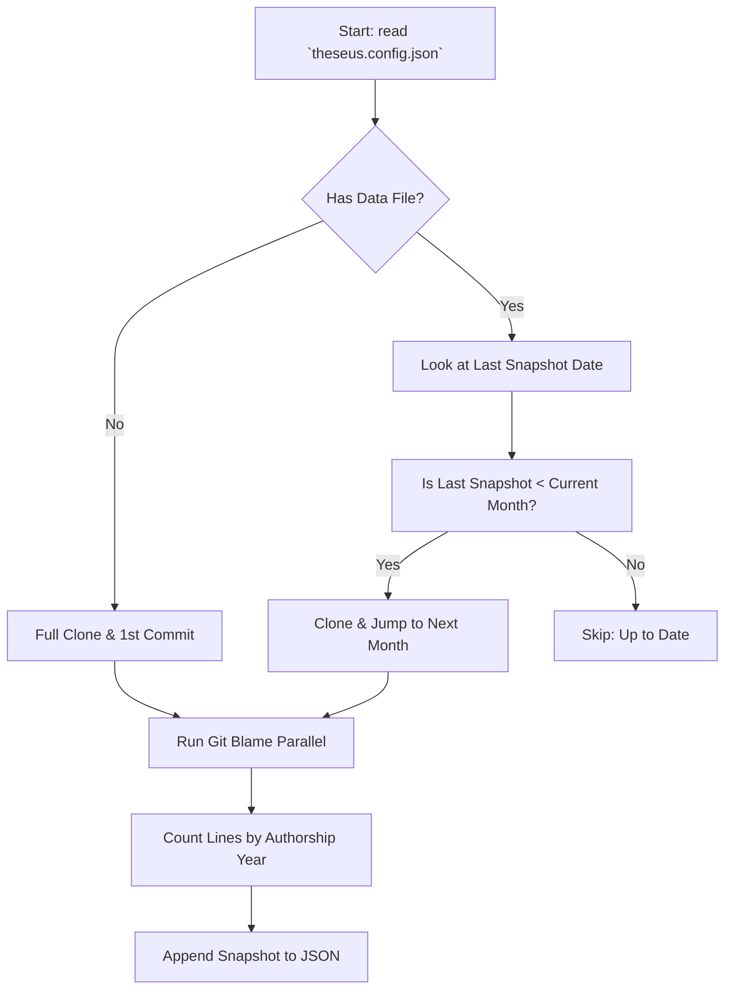
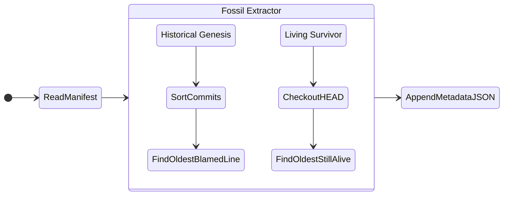
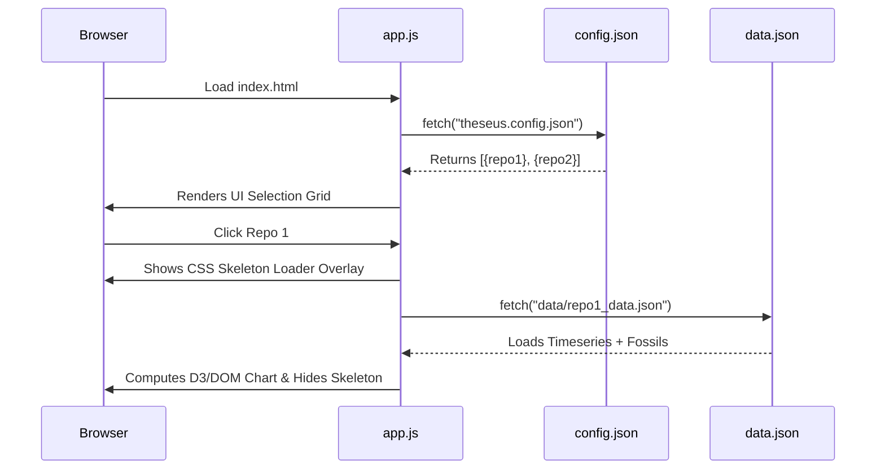

# Architecture & Internals

The Ship of Theseus engine is composed of a disconnected backend (data generator) and frontend (UI visualizer). They communicate entirely via an intermediary static JSON format. 

This architecture allows the system to remain highly secure, completely severless, and free to host using static GitHub Pages. (woohoo, who doesn't like free things?)

---

## The Data Pipeline (`analyse_repository.py`)

The heart of the application is a python script that orchestrates `git` shell commands. Because `git` is heavily optimized in C, shelling out to the native git binary is orders of magnitude faster than relying on pure Python implementations like `GitPython` or `pygit2`.

### Incremental Snapshot Generation

To view codebase health *over time*, we need snapshots of the codebase. Instead of re-parsing every commit since the dawn of time, the engine works incrementally.

### The `git blame` Parallelization

When checking out a specific month's commit, the system needs to `git blame` every single valid file in the repository.

1. **Ls-Files Filter:** We run `git ls-files` to get solely the tracked text files (excluding binary garbage).
2. **ThreadPool Executor:** The script fires off multiple parallel workers to run `git blame --line-porcelain` concurrently across CPUs.
3. **Regex Extraction:** It rips the UNIX timestamps out of the porcelain format and bins them into "years".

---

## The Fossil Extraction (`add_fossils.py`)

Fossils are pointers to specific, historically significant lines of code that serve as fun easter-eggs for the UI. They are evaluated completely independently to prevent slowing down the main incremental snapshot pipeline.

#### Historical (Genesis) Protocol
Repos imported from SVN/Mercurial can have wildly inaccurate committer timestamps. We resolve this by running `git log --all --pretty=format:%H %at` to sort all commits explicitly by `author-time`, stepping through the absolute oldest `genesis_depth` commits, and extracting the first line of code ever pushed to the repo's history regardless of branch logic.

#### Living (Survivor) Protocol
This focuses strictly on the default branch `HEAD`. It recursively blames the latest state of the codebase. Because it's checking `HEAD`, this value frequently moves as old code is finally refactored out.

---

## Data Delivery via Vanilla UI (`app.js`)

The UI is intentionally lightweight. We avoided heavy React or bundle-chain systems to ensure the repository remains simple and easy to fork.

The UI loads `theseus.config.json` via the browser Fetch API, builds out a repository selection grid dynamically, and upon clicking a card, pulls the corresponding static `data/{repo}_data.json`.

