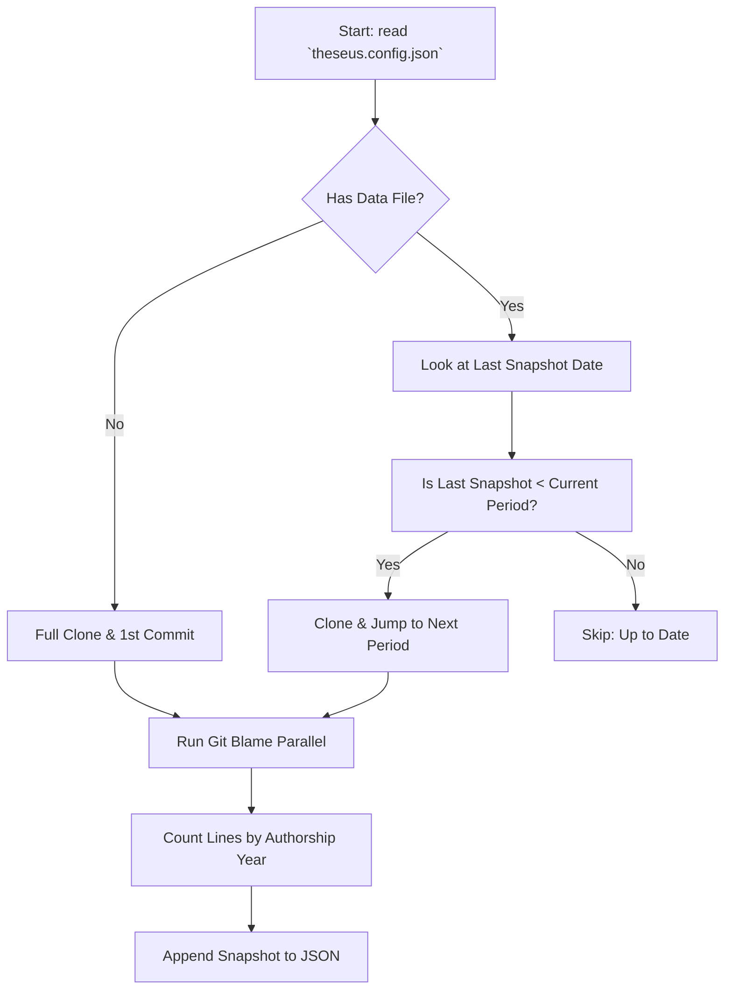
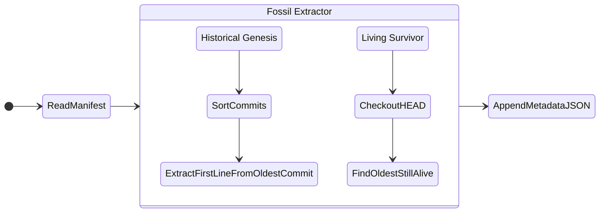
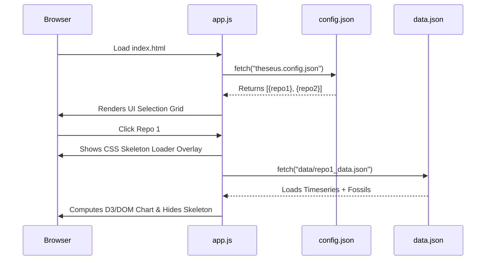

# Architecture & internals

The project has a Python script to generate data and a web frontend to display it. They communicate via static JSON files. 

This setup allows the site to be hosted on static platforms like GitHub Pages.

## The data pipeline (`analyse_repository.py`)

The data generator runs `git` shell commands directly instead of using Python libraries like `GitPython` or `pygit2`. This is significantly faster because the native `git` binary is optimized in C.

### Incremental snapshot generation

The script needs snapshots of the codebase over time. Rather than parsing every commit, it works incrementally.

```mermaid
flowchart TD
    A[Start: read `theseus.config.json`] --> B{Has Data File?}
    B -- No --> C[Full Clone & 1st Commit]
    B -- Yes --> D[Look at Last Snapshot Date]
    D --> E[Is Last Snapshot < Current Period?]
    E -- Yes --> F[Clone & Jump to Next Period]
    E -- No --> G[Skip: Up to Date]
    C --> H[Run Git Blame Parallel]
    F --> H
    H --> I[Count Lines by Authorship Year]
    I --> J[Append Snapshot to JSON]
```

### Git blame parallelization

When checking out a specific month's commit, the script runs `git blame` on every tracked file.

1. **ls-files filter:** Runs `git ls-files` to get only tracked text files.
2. **ThreadPool execution:** Uses multiple workers to run `git blame --line-porcelain` concurrently.
3. **Regex extraction:** Extracts UNIX timestamps from the porcelain output and groups them by year.

## Fossil extraction (`add_fossils.py`)

Fossils are pointers to the oldest lines of code. They are calculated independently so they don't slow down the main pipeline.

```mermaid
stateDiagram-v2
    direction LR
    [*] --> ReadManifest
    
    state "Fossil Extractor" as extractor {
        GenesisFossil: Historical Genesis
        SurvivorFossil: Living Survivor
        
        GenesisFossil --> SortCommits
        SortCommits --> ExtractFirstLineFromOldestCommit
        
        SurvivorFossil --> CheckoutHEAD
        CheckoutHEAD --> FindOldestStillAlive
    }
    
    ReadManifest --> extractor
    extractor --> AppendMetadataJSON
```

### Historical (Genesis) protocol
Repositories imported from SVN or Mercurial often have inaccurate committer timestamps. We resolve this by running `git log --all --pretty=format:%H %at` to sort commits by `author-time`, finding the absolute oldest commit. We then use `git diff-tree` to find files added in this commit and `git show` to directly extract the first line of code pushed to the history, avoiding the overhead of checking out the working tree or running `git blame`.

### Living (Survivor) protocol
This runs strictly on the default branch `HEAD`. It recursively blames the latest state of the codebase to find the oldest line still in use. This value shifts as old code gets refactored out.

## Data delivery via UI (`app.js`)

The frontend uses Vanilla JavaScript without a build system to keep the repository simple.

The UI fetches `theseus.config.json` via the browser Fetch API, builds a repository selection grid, and loads the corresponding `data/{repo}_data.json` when a user selects a repository.

```mermaid
sequenceDiagram
    participant Browser
    participant app.js
    participant config.json
    participant data.json
    
    Browser->>app.js: Load index.html
    app.js->>config.json: fetch("theseus.config.json")
    config.json-->>app.js: Returns [{repo1}, {repo2}]
    app.js->>Browser: Renders UI Selection Grid
    
    Browser->>app.js: Click Repo 1
    app.js->>Browser: Shows CSS Skeleton Loader Overlay
    app.js->>data.json: fetch("data/repo1_data.json")
    data.json-->>app.js: Loads Timeseries + Fossils
    app.js->>Browser: Computes D3/DOM Chart & Hides Skeleton
```
