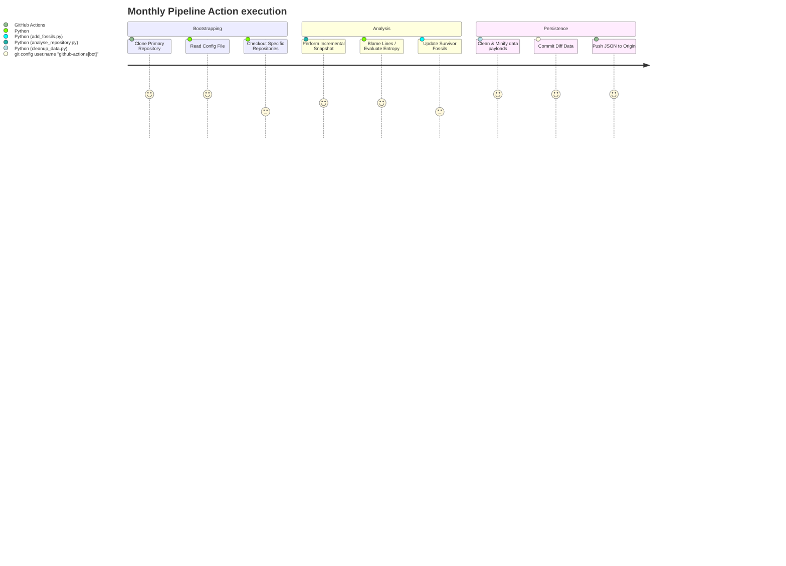

# 🤖 DevOps & CI/CD Pipeline

The Ship of Theseus engine doesn't just run once—codebases never stop evolving. The system relies entirely on GitHub Actions to provide zero-maintenance "monthly pulses" that autonomously update the data output repository.

## The Automation Engine (`.github/workflows/theseus-engine.yml`)

The primary workflow handles generating the JSON snapshot objects incrementally every month, tracking any changes, and pushing them back to the repository data block.

### 1. `analyse_repository.py` Trigger
The analyzer looks at `theseus.config.json` and pulls from the local `data/` cache. Because `analyse_repository.py` is fully incremental, it will read `snapshot_date="2025-02"` in the JSON, look at the wall-clock calendar time (e.g. `2025-05`), and figure out that it needs to specifically checkout the repositories at `2025-03`, `2025-04` and `2025-05` to catch up to the current date. It will execute these checkouts locally within the GitHub Actions runner.

### 2. `add_fossils.py --update-survivor` Trigger
Genesis fossils rarely change unless a codebase undergoes an extreme edge-case rewrite of its absolute first commit history. The UI primarily benefits from tracking the *"Living Fossil"*. 

To save processing time during CI constraints, the Action only triggers `add_fossils.py` with the `--update-survivor` flag, bypassing sorting all commits for Genesis creation completely, and simply updating the `view_commit` tip to track code changes.

### 3. File Re-commit Handling
Finally, the action checks if the snapshot array or the survivor fossil commit length actually triggered a diff against the origin.

If `git status` shows modifications to the JSON payloads inside `data/`, the robotic GitHub Actions bot commits the payload and forces a synchronized write onto `main`. This allows the repository to essentially act as its own self-healing backend Database.

---

> [!TIP]
> Ensure the Action is allowed Write permissions in the repository settings: `Settings -> Actions -> General -> Workflow permissions -> Read and write permissions`. Otherwise, the robotic commit will result in `HTTP 403` and the pipeline will fail silently.
