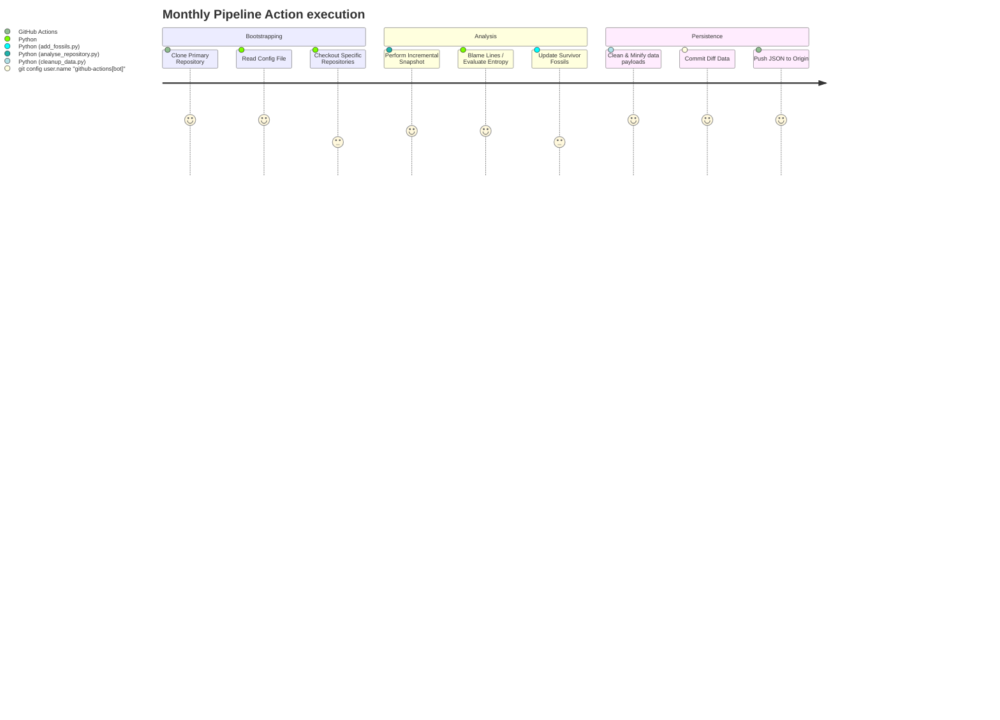

# DevOps and CI/CD

The system uses GitHub Actions to run monthly updates on the configured repositories.

## The GitHub Actions workflow (`.github/workflows/theseus-engine.yml`)

The primary workflow generates incremental JSON snapshots every month and commits any changes back to the repository.

```mermaid
journey
    title Monthly Pipeline Action execution
    section Bootstrapping
      Clone Primary Repository: 5: GitHub Actions
      Read Config File: 5: Python
      Checkout Specific Repositories: 3: Python
    section Analysis
      Perform Incremental Snapshot: 4: Python (analyse_repository.py)
      Blame Lines / Evaluate Entropy: 4: Python
      Update Survivor Fossils: 3: Python (add_fossils.py)
    section Persistence
      Clean & Minify data payloads: 5: Python (cleanup_data.py)
      Commit Diff Data: 5: git config user.name "github-actions[bot]"
      Push JSON to Origin: 5: GitHub Actions
```

### 1. `analyse_repository.py`
The script reads `theseus.config.json` and checks the local `data/` cache. If the latest snapshot in the JSON is `2025-02` and the current month is `2025-05`, the script checks out the repository at `2025-03`, `2025-04`, and `2025-05` to catch up.

### 2. `add_fossils.py --update-survivor`
Genesis fossils rarely change because they point to the very first commit. The UI primarily tracks the "Living Fossil," which moves when old code is deleted. 

To save processing time during CI, the Action only runs `add_fossils.py` with the `--update-survivor` flag, updating the `view_commit` tip to track code changes without re-evaluating the entire history.

### 3. Committing updates
After the scripts run, the Action checks if the output files in `data/` have changed. 

If there are modifications, the GitHub Actions bot commits the new JSON payloads to `main`. 

> [!TIP]
> Ensure the Action has Write permissions in the repository settings: `Settings -> Actions -> General -> Workflow permissions -> Read and write permissions`. Otherwise, the commit attempt will return an `HTTP 403` error and fail silently.
