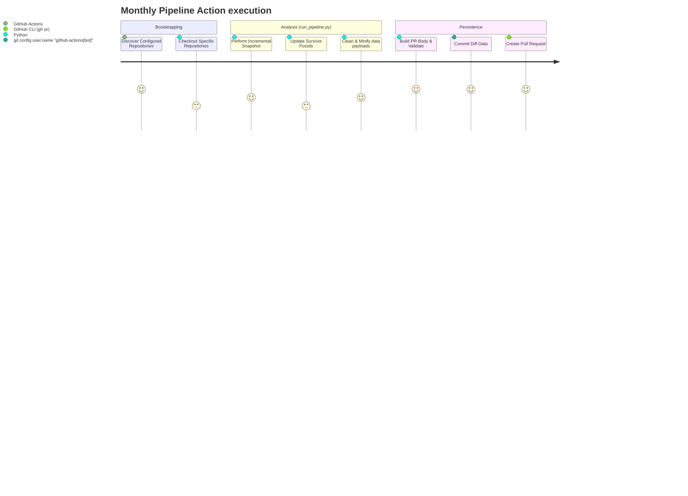

# DevOps and CI/CD

The system uses GitHub Actions to run monthly updates on the configured repositories.

## The GitHub Actions workflow (`.github/workflows/theseus-engine.yml`)

The primary workflow generates incremental JSON snapshots every month and commits any changes back to the repository.

```mermaid
journey
    title Monthly Pipeline Action execution
    section Bootstrapping
      Discover Configured Repositories: 5: GitHub Actions
      Checkout Specific Repositories: 3: Python
    section Analysis (run_pipeline.py)
      Perform Incremental Snapshot: 4: Python
      Update Survivor Fossils: 3: Python
      Clean & Minify data payloads: 4: Python
    section Persistence
      Build PR Body & Validate: 5: Python
      Commit Diff Data: 5: git config user.name "github-actions[bot]"
      Create Pull Request: 5: GitHub CLI (gh pr)
```

### 1. `run_pipeline.py`
The workflow orchestrates analysis across all configured repositories in a matrix job by calling `run_pipeline.py --update-survivor`. This script manages the three pipeline stages: incremental snapshot analysis, survivor fossil extraction, and payload cleanup.

### 2. Updating Survivor Fossils
Genesis fossils rarely change because they point to the very first commit. The UI primarily tracks the "Living Fossil," which moves when old code is deleted.

To save processing time during CI, the Action runs the pipeline with the `--update-survivor` flag, updating the `view_commit` tip to track code changes without re-evaluating the entire history.

### 3. Committing updates
After the pipeline runs across all repositories, the `create-pr` job downloads the combined data artifacts and checks if any files have changed.

If there are modifications, the GitHub Actions bot commits the new JSON payloads to a branch (`chore/monthly-data-update`) and automatically opens or updates a Pull Request to `main`.

> [!TIP]
> Ensure the Action has Write permissions in the repository settings: `Settings -> Actions -> General -> Workflow permissions -> Read and write permissions`. Otherwise, the PR creation attempt will return an `HTTP 403` error and fail silently.

## The GitHub Actions workflow (`.github/workflows/update-fossils.yml`)

An additional manual workflow to force-update fossils via `workflow_dispatch`. It runs `add_fossils.py` (which auto-detects and backfills Genesis/Survivor fossils) and `cleanup_data.py`, then commits changes directly to `chore/fossil-update`.
